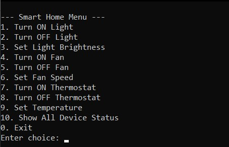
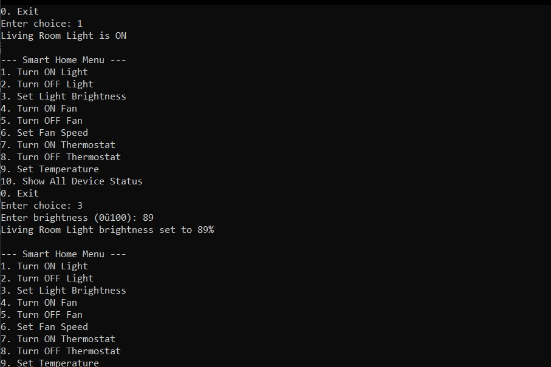
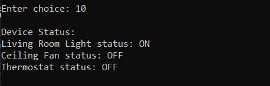

# Smart Home Automation Simulator (C++)

---

## <small>Project Description</small>

<small>The **Smart Home Automation Simulator** is a console-based C++ application designed to demonstrate core **Object-Oriented Programming (OOP)** principles through a real-world inspired problem.</small>

<small>This project simulates a basic smart home environment where different smart devices (Light, Fan, Thermostat) can be controlled through a **menu-driven interface**.  
The codebase is structured to be **easy to read, extend, and maintain**, making it suitable for collaborative development and academic use.</small>

<small>This documentation is written so that **any new team member can understand the project without prior context**.</small>

---

## <small>Introduction</small>

<small>Modern software systems are built using object-oriented design to ensure modularity and scalability.  
This project applies those principles in a simple and practical way by modeling smart home devices as objects with shared and specialized behaviors.</small>

<small>The application runs entirely in the terminal and focuses on **clarity of design rather than complexity**.</small>

---

## <small>Technologies Used</small>

<small>✨ **Programming Language:** C++  
✨ **Paradigm:** Object-Oriented Programming (OOP)  
✨ **Compiler:** GCC / G++  
✨ **Platform:** Cross-platform (Windows, Linux, macOS)  
✨ **Interface:** Command-line (Menu Driven)</small>

---

## <small>Features</small>

<small>⚡ The system allows users to:</small>  

<small>🌟 Turn smart devices ON and OFF  
🌟 Control device-specific settings:  
  💡 Light brightness  
  🌬️ Fan speed  
  🌡️ Thermostat temperature  
🌟 View the current status of all devices  
🌟 Interact with the system using a simple menu</small>

---

## <small>Keyboard / Menu Controls</small>

<small>The program is operated using numeric menu options:</small>  

| Option | Action |
|------|-------|
| 1 | Turn ON Light |
| 2 | Turn OFF Light |
| 3 | Set Light Brightness |
| 4 | Turn ON Fan |
| 5 | Turn OFF Fan |
| 6 | Set Fan Speed |
| 7 | Turn ON Thermostat |
| 8 | Turn OFF Thermostat |
| 9 | Set Temperature |
| 10 | Show All Device Status |
| 0 | Exit Program |

---

## <small>Development Process (How This Was Built)</small>

<small>🔹 **Problem Breakdown**  
  🎯 Identified common smart home devices  
  🎯 Defined shared behaviors (ON/OFF, status)</small>

<small>🔹 **Class Design**  
  🎯 Created a base `Device` class  
  🎯 Derived specialized classes (`Light`, `Fan`, `Thermostat`)</small>

<small>🔹 **OOP Implementation**  
  🎯 Used inheritance to avoid code duplication  
  🎯 Applied encapsulation to protect device data  
  🎯 Used polymorphism via base class pointers</small>

<small>🔹 **Controller Logic**  
  🎯 Implemented a `SmartHome` controller to manage devices</small>

<small>🔹 **User Interaction**  
  🎯 Added a menu-driven interface for user input  
  🎯 Connected menu actions to device methods</small>

---

## <small>What We Learned</small>

<small>✨ How to design a clean class hierarchy  
✨ Proper use of inheritance and method reuse  
✨ How polymorphism simplifies device management  
✨ Writing readable and maintainable C++ code  
✨ Structuring a small project for team collaboration</small>

---

## <small>Possible Improvements</small>

<small>🌟 Add more devices (Smart TV, Door Lock, Camera)  
🌟 Store device states using file handling  
🌟 Convert menu system into a GUI  
🌟 Split code into header (`.h`) and implementation (`.cpp`) files  
🌟 Add user authentication  
🌟 Introduce scheduling (timers for devices)</small>

---
## Screenshots

### Smart Home Menu

### Changing Device Settings

### All Device Status

